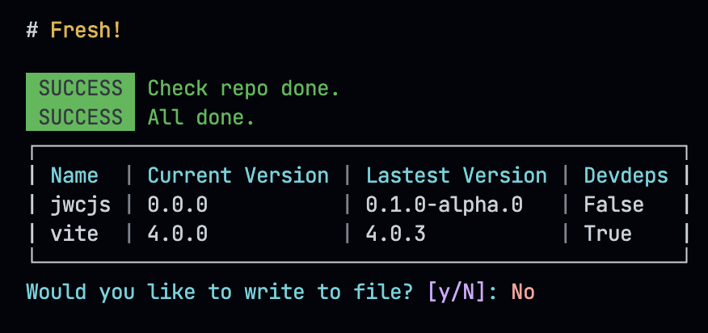
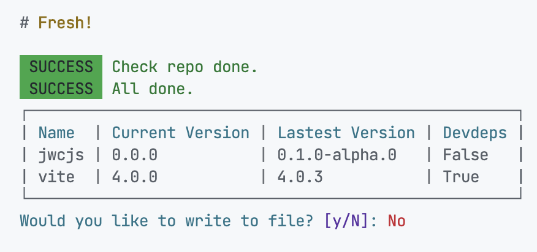

# Taze-go

A simple CLI tools to make your npm pacakges dependency fresh, but written in Go.

## Install

1. Git clone this repo
2. `go build`
3. Add `taze-go[.exe]` to your `$PATH`

## Usage

Just `taze-go`.

## Screen shot

